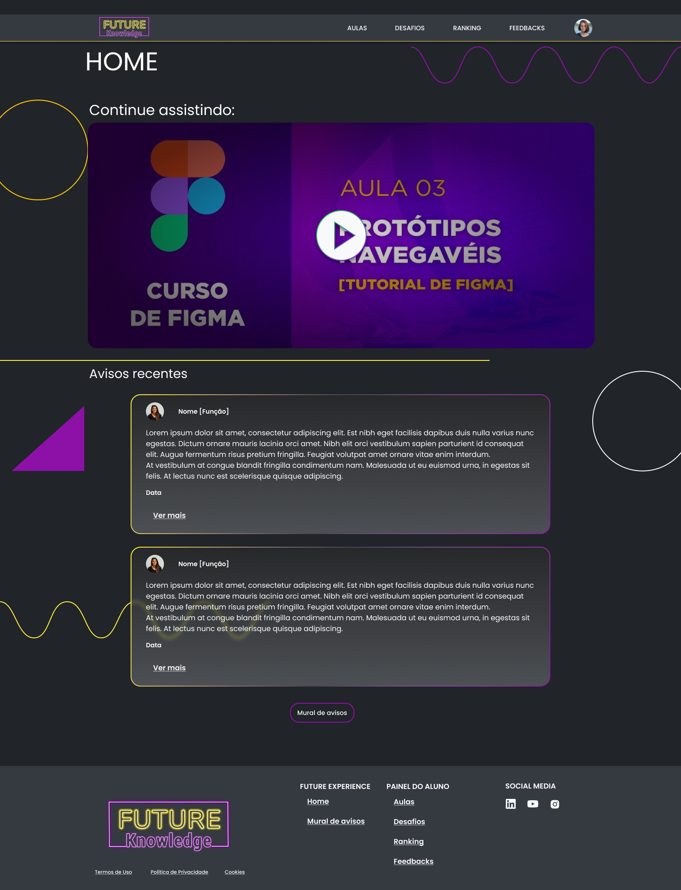
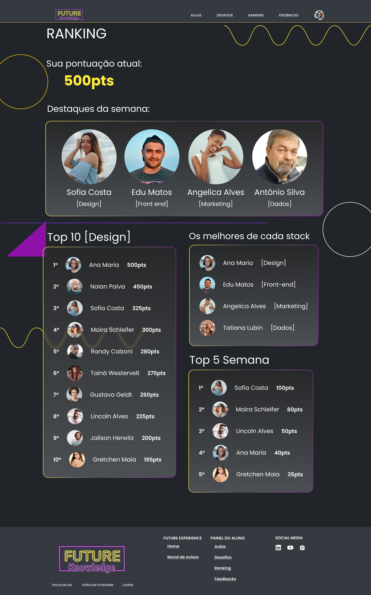

<!-- # server alternativo 
   - instalação: npm install -g json-server
   - execute serve: json-server --watch db.json

#  app
   - Execute app: npm run dev

{
   "id": "13f238d3-4c3f-458a-b219-5656ae3421a1",
   "name": "David Facó",
   "age": "27",
   "email": "davidfaco@gmail.com",
   "field": "software development",
   "points": 100,
   "avatar": "https://github.com/David.png"
}, -->

<h1 align="center"> Future Knowledge </h1>

Desenvolvido por Ivan Barbosa. 

  
  

 

## 💻 Projeto

- Desenvolvido 2 telas Home e Ranking de acordo com o design fornecido pelo Figma.
- Tela Ranking consome uma API REST, realizando as seguintes operações, GET, PATCH e DELETE.

## 🚀 Tecnologias

Esse projeto foi desenvolvido com as seguintes tecnologias:

- Node.js
- React / Vite
- JavaScript
- CSS / Styled Components

## 🔖 Dependências

Para o Cliente, usamos:
- React 12.2.*
- styled-components 6.0.8
- Node.js v18.12.*
- axios 1.5.*

## 💻 Clone e acesse o projeto
------------
    `https://github.com/ivanbs14/Blog.git`

    or 

    `gh repo clone ivanbs14/Blog`

## 💻 Configurar e executar API REST local
------------
Acesse a pasta do cliente:

`cd future/`

Agora, e execute seu aplicativo

`json-server --watch db.json`

Verifique se a API esta em execução no local: http://localhost:3000  (este endereço acima pode variar)

## 💻 Configurar e executar cliente
------------
Acesse a pasta do cliente:

`cd future/`

Agora, instale e execute seu aplicativo

`npm install`

`npm run dev`

Verifique se o aplicativo front-end esta em execução no local: http://localhost:5173/  (este endereço acima pode variar)

## Qualquer dúvida, envie um e-mail para

`ivanbarbosab@gmail.com`

---
